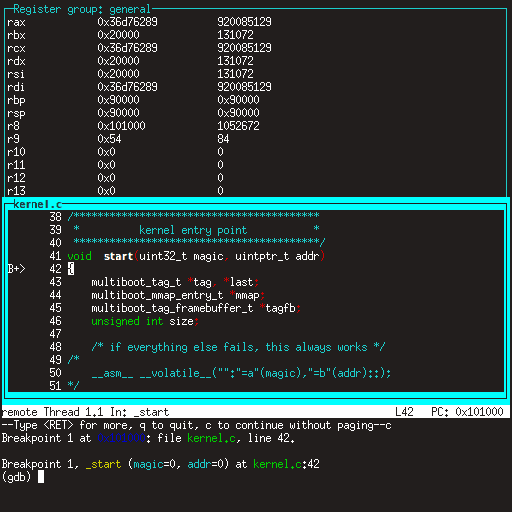

Debugging Your Kernel
=====================

If your kernel goes havoc, by default **Easyboot** will do you a favour to display details about what and where went wrong.


This is enough to give you a clue, but it does not allow you to interactively investigate. For that, you would need a debugger.

Mini Debugger
-------------

Advantages:

- easy to set up
- easy to use
- works on real hardware and virtual machines as well

Disadvantages:

- as name suggests, minimal feature set

To enable the [Mini Debugger](https://gitlab.com/bztsrc/minidbg), just install the **Easyboot** [plugin](plugins.md) by copying the
appropriate `minidbg_(arch).plg` file to your boot partition. That's it. It provides a video terminal interface over serial line
(with 115200 baud, 8 data bits, 1 stop bit, no parity).

On real hardware, attach a VT100 or VT220 terminal, or another machine over serial cable running **PuTTY** (Windows) or **minicom**
(Linux).

For virtual machines, just run qemu with the `-serial stdio` arguments, and you'll be able to control the debugger from the same
window that you've used to run qemu. For example:

```
qemu-system-x86_64 -serial stdio -hda disk.img
```

Any time your kernel blows off, you'll get a debugger prompt instantly and you'll be able to examine the situation. In the debugger
prompt, type `?` or `h` to get help. To explicitly invoke the debugger, insert `int 3` (a 0xCC byte) into your code. I suggest to
add the following define to your kernel:

```c
/* x86 */
#define breakpoint __asm__ __volatile__("int $3")
/* ARM */
#define breakpoint __asm__ __volatile__("brk #0")
```

```
Mini debugger by bzt
Exception 03: Breakpoint instruction, code 0
rax: 0000000000000000  rbx: 00000000000206C0  rcx: 000000000000270F
rdx: 00000000000003F8  rsi: 00000000000001B0  rdi: 0000000000102336
rsp: 000000000008FFB8  rbp: 000000000008FFF8   r8: 0000000000000004
 r9: 0000000000000002  r10: 0000000000000000  r11: 0000000000000003
r12: 0000000000000000  r13: 0000000000000000  r14: 0000000000000000
r15: 0000000000000000
> ?
Mini debugger commands:
  ?/h		this help
  c		continue execution
  n		move to the next instruction
  r		dump registers
  x [os [oe]]	examine memory from offset start (os) to offset end (oe)
  i [os [oe]]	disassemble instructions from offset start to offset end
> i pc-1 pc+4
00101601: CC                             int	3
00101602: FA                             cli
00101603: F4                             hlt
00101604: EB FC                          jmp	101602h
00101606: 90                              1 x nop
>
```

Qemu Debugger
-------------

Advantages:

- no set up, works out-of-the-box
- displays the machine's internal state, that no other debugger can do

Disadvantages:

- really hard to use
- only works with virtual machines

When your virtual machine is running, from the menu select `View` > `compatmonitor0`, or click on the window so that it grabs the
focus and press <kbd>Ctrl</kbd>+<kbd>Alt</kbd>+<kbd>2</kbd> (to release the focus press <kbd>Ctrl</kbd>+<kbd>Alt</kbd>+<kbd>G</kbd>).

GDB
---

Advantages:

- fully featured debugger
- provides all the features you can think of

Disadvantages:

- tricky to set up
- only works with virtual machines

Before you do anything, first modify your build environment to generate two kernel files. One with debug symbols, and another one
without. This is important because debug symbols can easily take up a lot of space, probably several megabytes. First, compile your
kernel with the `-g` flag. Then after the compilation is done, copy your kernel `cp mykernel.elf mykernel_sym.elf`, and remove the
debug info with `strip mykernel.elf`. Hereafter you are going to boot `mykernel.elf`, and you'll supply `mykernel_sym.elf` to gdb.

Next, create a gdb script named `gdb.rc`. Use the following as a template:

```
target remote localhost:1234
set architecture i386:x86-64
symbol-file mykernel_sym.elf
layout split
layout src
layout regs
break *_start
continue
```

This connects gdb to the virtual machine, tells it the machine's type, loads the debug information, configures the layout, sets a
breakpoint right at your kernel's entry point, and finally starts the virtual machine.

After this set up is once done, you can start debugging. One debug session goes like this: in one terminal, start qemu with the
`-s -S` flags. It will hang. For example:

```
qemu-system-x86_64 -s -S -hda disk.img
```

Then in another terminal, start gdb with the script that we have created previously:

```
gdb -w -x gdb.rc
```

This should display everything in one window like this:



If you made it this far then congratulations, you can start the real work with your kernel!
