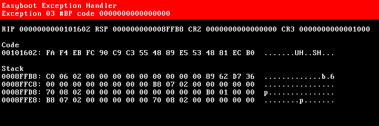

Depurando su kernel
===================

Si su kernel causa estragos, de forma predeterminada **Easyboot** le hará un favor al mostrar detalles sobre qué y dónde salió mal.



Esto es suficiente para darle una pista, pero no le permite investigar de forma interactiva. Para eso, necesitarás un depurador.

Mini Debugger
-------------

Ventajas:

- fácil de configurar
- fácil de usar
- funciona también en hardware real y en máquinas virtuales

Desventajas:

- como sugiere el nombre, conjunto mínimo de funciones

Para habilitar el [Mini Debugger](https://gitlab.com/bztsrc/minidbg), simplemente instale el [complemento](plugins.md) **Easyboot**,
copiando el archivo `minidbg_(arch).plg` apropiado a su partición de arranque. Eso es todo. Proporciona una interfaz de terminal de
vídeo a través de línea serie (con 115200 baudios, 8 bits de datos, 1 bit de parada, sin paridad).

En hardware real, conecte un terminal VT100 o VT220, u otra máquina a través de un cable serie que ejecute **PuTTY** (Windows) o
**minicom** (Linux).

Para máquinas virtuales, simplemente ejecute qemu con los argumentos `-serial stdio` y podrá controlar el depurador desde la misma
ventana que utilizó para ejecutar qemu. Por ejemplo:

```
qemu-system-x86_64 -serial stdio -hda disco.img
```

Cada vez que su kernel falla, recibirá un aviso del depurador al instante y podrá examinar la situación. En el mensaje del
depurador, escriba `?` o `h` para obtener ayuda. Para invocar explícitamente el depurador, inserte `int 3` (un byte 0xCC) en su
código. Sugiero agregar la siguiente definición a su kernel:

```c
/* x86 */
#define breakpoint __asm__ __volatile__("int $3")
/* ARM */
#define breakpoint __asm__ __volatile__("brk #0")
```

```
Mini debugger by bzt
Exception 03: Breakpoint instruction, code 0
rax: 0000000000000000  rbx: 00000000000206C0  rcx: 000000000000270F
rdx: 00000000000003F8  rsi: 00000000000001B0  rdi: 0000000000102336
rsp: 000000000008FFB8  rbp: 000000000008FFF8   r8: 0000000000000004
 r9: 0000000000000002  r10: 0000000000000000  r11: 0000000000000003
r12: 0000000000000000  r13: 0000000000000000  r14: 0000000000000000
r15: 0000000000000000
> ?
Mini debugger commands:
  ?/h		this help
  c		continue execution
  n		move to the next instruction
  r		dump registers
  x [os [oe]]	examine memory from offset start (os) to offset end (oe)
  i [os [oe]]	disassemble instructions from offset start to offset end
> i pc-1 pc+4
00101601: CC                             int	3
00101602: FA                             cli
00101603: F4                             hlt
00101604: EB FC                          jmp	101602h
00101606: 90                              1 x nop
>
```

Qemu Debugger
-------------

Ventajas:

- sin configuración, funciona de inmediato
- muestra el estado interno de la máquina, que ningún otro depurador puede hacer

Desventajas:

- realmente difícil de usar
- solo funciona con máquinas virtuales

Cuando su máquina virtual se esté ejecutando, en el menú seleccione `View` > `compatmonitor0`, o haga clic en la ventana para que
capte el foco y presione <kbd>Ctrl</kbd>+<kbd>Alt</kbd>+ <kbd>2</kbd> (para liberar el foco presione
<kbd>Ctrl</kbd>+<kbd>Alt</kbd>+<kbd>G</kbd>).

GDB
---

Ventajas:

- depurador con todas las funciones
- proporciona todas las características que puedas imaginar

Desventajas:

- difícil de configurar
- solo funciona con máquinas virtuales

Antes de hacer cualquier cosa, primero modifique su entorno de compilación para generar dos archivos del kernel. Uno con símbolos
de depuración y otro sin ellos. Esto es importante porque los símbolos de depuración pueden ocupar fácilmente mucho espacio,
probablemente varios megabytes. Primero, compila tu kernel con el indicador `-g`. Luego, una vez finalizada la compilación, copie
su kernel `cp mykernel.elf mykernel_sym.elf` y elimine la información de depuración con `strip mykernel.elf`. De ahora en adelante,
iniciará `mykernel.elf` y proporcionará `mykernel_sym.elf` a gdb.

A continuación, cree un script gdb llamado `gdb.rc`. Utilice lo siguiente como plantilla:

```
target remote localhost:1234
set architecture i386:x86-64
symbol-file mykernel_sym.elf
layout split
layout src
layout regs
break *_start
continue
```

Esto conecta gdb a la máquina virtual, le indica el tipo de máquina, carga la información de depuración, configura el diseño,
establece un punto de interrupción justo en el punto de entrada de su kernel y finalmente inicia la máquina virtual.

Una vez realizada esta configuración, puede comenzar a depurar. Una sesión de depuración es así: en una terminal, inicie qemu con
las banderas `-s -S`. Se colgará. Por ejemplo:

```
qemu-system-x86_64 -s -S -hda disco.img
```

Luego en otra terminal iniciamos gdb con el script que hemos creado anteriormente:

```
gdb -w -x gdb.rc
```

Esto debería mostrar todo en una ventana como esta:


Si has llegado hasta aquí, felicidades, ¡puedes empezar a trabajar de verdad con tu kernel!
